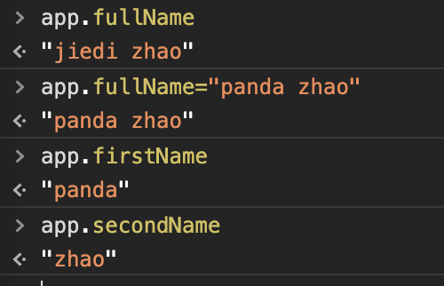

====================
邂逅vue
====================

认识vuejs
===========================

-  为什么学习vuejs
-  vue的读音
-  vue的渐进式
-  vue的特点

vue的安装
==========================

-  cdn引入
-  下载引入
-  npm安装

vue的初体验
============================

-  hello vuejs

   -  mustache 响应式

-  vue列表展示

   -  v-for

-  vue计数器

   -  事件监听click  

vue的mvvm

-  model
-  modelview
-  view  
vue的options

-  el
-  data
-  methods
-  生命周期

插值语法
=========================

-  mustache语法
-  v-once
-  v-html
-  v-text
-  v-pre
-  v-cloak

v-bind
=============================

动态绑定属性
^^^^^^^^^^^^

-  v-bind绑定src
-  v-bind绑定href

v-bind 动态绑定class
^^^^^^^^^^^^^^^^^^^^

-  对象语法
-  数组语法

v-bind 动态绑定style
^^^^^^^^^^^^^^^^^^^^

-  对象语法
-  数组语法

计算属性
~~~~~~~~

-  案例1： fistname+secondname
-  案例2： books-> price

计算属性
=============================

-------------------------
基本使用
-------------------------
通过计算属性，我们可以完成多个变量的合并工作。

.. literalinclude:: ../../day01/04-计算属性/01-计算属性基本使用.html
   :encoding: utf-8
   :language: html
   :emphasize-lines: 18-22,6-8
   :linenos:
   :lines: 1,4-

-------------------------
复杂使用
-------------------------
通过计算属性，我们可以完成多个变量的复杂工作。

.. literalinclude:: ../../day01/04-计算属性/02-计算属性复杂使用.html
   :encoding: utf-8
   :language: html
   :emphasize-lines: 18-22,6-8
   :linenos:
   :lines: 1,4-

-------------------------
getter和setter
-------------------------
通过计算属性，可以给计算属性设置get和set

.. literalinclude:: ../../day01/04-计算属性/03-计算属性的getter和setter.html
   :encoding: utf-8
   :language: html
   :emphasize-lines: 18-22,6-8
   :linenos:
   :lines: 1,4-

效果图

